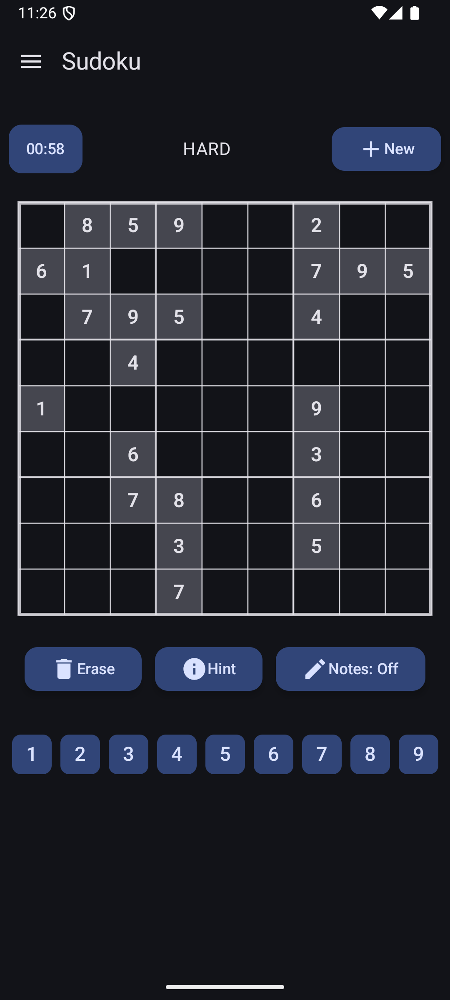
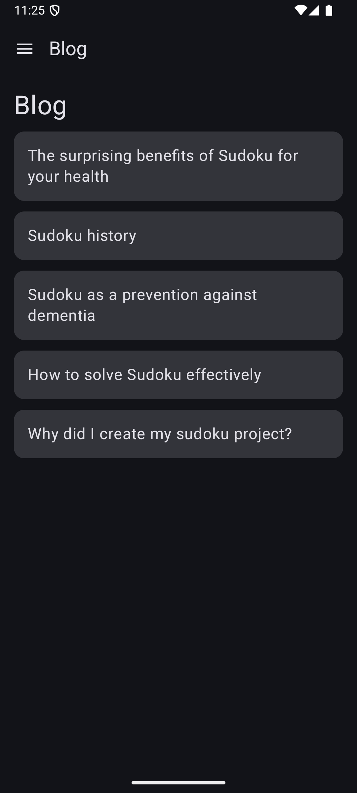

# Neurodoku - Sudoku Solver & Generator with Visualizations

## Overview

**Neurodoku** is an interactive **mobile Sudoku application for Android** that goes beyond basic puzzle gameplay.  
It features real-time solving visualizations using a recursive backtracking algorithm,  
a clean and intuitive UI, and tools to help users train logic and focus.

This project was created as a fun and educational challenge to explore algorithmic thinking, UI/UX design, and mobile development on Android.  
Whether you're a casual player or a programming enthusiast, there's something here for you.

## Features

### Gameplay & Logic
- **Sudoku Puzzle Generator** – Creates valid Sudoku boards across four difficulty levels: Easy, Medium, Hard, and Extreme.
- **Solver with Visualization** – Solves puzzles using a recursive backtracking algorithm, with step-by-step animation.
- **Timer** – Tracks puzzle-solving time with pause and resume functionality.
- **Hints & Editing Tools**
  - Request a hint for the current puzzle
  - Erase entered numbers
  - Restart the puzzle to its original state
  - Generate a completely new puzzle
  - **Notes Mode** – Toggle a pencil mode to write multiple possible numbers into a cell
  
  <p align="center">
  
  
  
</p>

### Brain Health Awareness
- **Dementia Prevention Tips** – During paused state, the app shows helpful tips related to cognitive health and lifestyle.
 <p align="center">
  
  
</p>

### Blog & Educational Content
- **In-App Blog Section** – Read short articles about dementia prevention, cognitive health, and Sudoku-solving strategies.
- Articles include:
  - Mental wellness tips for seniors
  - How Sudoku helps maintain cognitive function
    - Strategies and logic techniques for solving puzzles efficiently
<p align="center">
  
  
  
</p>

### User Accounts & Profiles
- **Sign up / Log in** – Create an account using email and password, or log in via your Google account.
- **Custom Profiles** – Set your display name and write a short bio after logging in.
- **User Statistics** – Track how many puzzles you've solved per difficulty level.
- **Progress Saving** – Store your puzzle history and preferences locally using Room and in the cloud with Firebase.
<p align="center">
  
  
  
  
  
  
</p>

### UI/UX Features
- **Jetpack Compose UI** – Built with modern Android UI framework for a smooth and responsive experience.
- **Dark Mode Support** – Toggle between light and dark themes in the Settings screen.
- **Clean and Consistent Design** – A uniform, material-themed interface focused on readability and ease of use.
<p align="center">
  
  
</p>

### Support
- **In-App Support Screen** – Easily contact the developer in case of issues or feedback.
<p align="center">
  
  
</p>

### Testing
- **Unit Tests** – Includes unit tests for puzzle generation/solving logic, timer, and UI components using JUnit and Mockito.

## Tech Stack

The application is built natively for Android using modern development tools and libraries:

- **Kotlin** – Primary programming language
- **Jetpack Compose** – Declarative UI framework for building responsive and modern interfaces
- **Android SDK** – Core tools and APIs for Android development
- **Room** – Local database for storing puzzles and user data
- **Koin** – Lightweight dependency injection framework
- **Firebase Authentication** – User sign-in and account management
- **Firebase Firestore** – Cloud database for syncing game history (optional)
- **Navigation Compose** – Declarative navigation between screens
- **Material 3** – Latest Material Design components and theming
- **KSP** – Kotlin Symbol Processing for annotation-based code generation
- **JUnit & Mockito** – Unit testing and mocking

## Getting Started

Follow these steps to build and run the app locally.

### 1. Prerequisites

- **Android Studio Hedgehog or newer**
- **JDK 17**
- **Gradle 8+** (optional, Android Studio manages it automatically)
- **Android SDK** installed with emulator or physical device

---

### 2. Clone the Repository

```bash
git clone https://github.com/your-username/neurodoku.git
cd neurodoku
```

---

### 3. Open in Android Studio

1. Open Android Studio
2. Choose **"Open an Existing Project"**
3. Navigate to the cloned `neurodoku` folder
4. Let Gradle sync and index the project (this may take a moment)

---

### 4. Run the App

- Connect your Android device or start an emulator.
- Click **Run ▶️** in Android Studio, or run from terminal:

```bash
./gradlew installDebug
```

---

### 5. (Optional) Firebase Setup

If you'd like to enable authentication and Firestore features:

1. Create a Firebase project at [https://console.firebase.google.com](https://console.firebase.google.com)
2. Add an Android app and register the package name (e.g., `com.example.neurodoku`)
3. Download the `google-services.json` file and place it in:
   ```
   app/google-services.json
   ```
4. Rebuild the project.

---

### 6. Run Unit Tests

To run all tests:

```bash
./gradlew test
```

---

### 7. Code Style & Linting

To ensure code style is consistent:

```bash
./gradlew lint
```

---

### 8. Troubleshooting

If the build fails on first run:

- Try running `File → Invalidate Caches & Restart` in Android Studio
- Ensure you're using the correct JDK and Gradle versions  

## Usage

Once the app is installed and launched, here's how users can interact with Neurodoku:

---

### Starting a New Puzzle

### Starting a New Puzzle

- When the app launches, a **Sudoku puzzle is automatically generated** at **Medium** difficulty.
- To start a new puzzle with a different difficulty:
  1. Tap **New Sudoku**
  2. A dialog appears with four difficulty options:  
     Easy, Medium, Hard, Extreme
  3. Select your preferred level — the app will generate a new puzzle accordingly.

- During gameplay, you can:
  - Use **Notes Mode** to jot down multiple possible candidates in a cell
  - Tap **Hint** to reveal one correct number
  - Tap **Erase** to remove an incorrect or unwanted number

### Pause & Brain Tips

- Tap the **Timer** button to stop the timer.
- During the paused state, the app shows **brain health tips** related to dementia prevention.

---

### User Statistics

- In the **Statistics screen**, view how many puzzles you’ve completed in each difficulty.

---

###  User Account

- Sign up or log in using:
  - Email and password
  - Or your **Google account**
- After logging in, create a simple profile:
  - Add a display name and a short bio

---

### Blog

- Visit the in-app **Blog** for short articles:
  - Sudoku solving techniques
  - Mental wellness and cognitive health
  - Lifestyle habits to reduce dementia risk

---

### Settings

- Enable **Dark Mode** manually, or follow system settings.
- Access the **Support** screen to contact the developer if needed.

## Architecture

This project follows the principles of **Clean Architecture** and the **MVVM (Model-View-ViewModel)** pattern, with a clear separation of concerns across the following layers:

### Directory Structure

```
data/
├── blog/
│   ├── local/           # Local blog storage (e.g. Room entities, DAOs)
│   └── repository/      # Blog data source implementation
├── sudoku/
│   ├── local/           # Local Sudoku storage (saved games, history)
│   ├── mapper/          # Mapping between domain and data models
│   └── repository/      # Sudoku data source implementation

di/
├── DatabaseModule.kt    # Room database setup and bindings
└── ViewModelModul.kt    # Koin bindings for ViewModels

domain/
├── model/               # Core business models (e.g. SudokuGame, SudokuDifficulty)
└── usecase/             # Business logic (e.g. generate, mask, save Sudoku)

ui/
├── components/          # Reusable UI components built with Jetpack Compose
├── navigation/          # Navigation graph using Navigation-Compose
├── screens/             # UI screens (Game, Blog, Stats, etc.)
├── theme/               # Material 3 theming (colors, typography)
└── viewmodel/           # ViewModels providing state and logic for screens
```

### Design Principles

- **Separation of Concerns**: Each layer is responsible for a single aspect of the app's functionality.
- **Testability**: Use cases and ViewModels are unit-testable and decoupled from framework code.
- **Reusability**: UI components and business logic are modular and reusable.
- **Scalability**: This architecture supports future expansion, including new features, modules, or platforms.

### Tools & Libraries

- **Koin** for dependency injection
- **Jetpack Compose** for declarative UI
- **Room** for local persistence
- **Firebase Auth & Firestore** for optional cloud features

